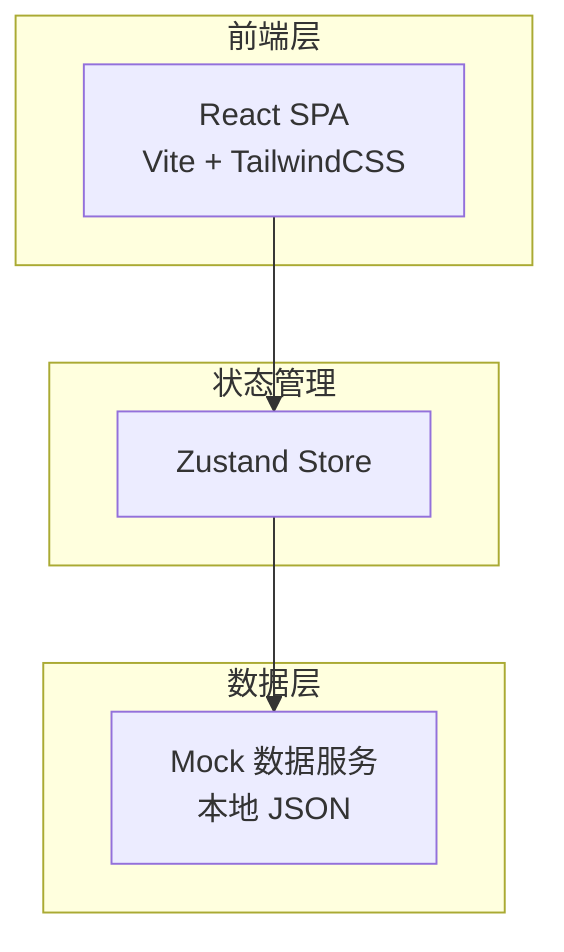
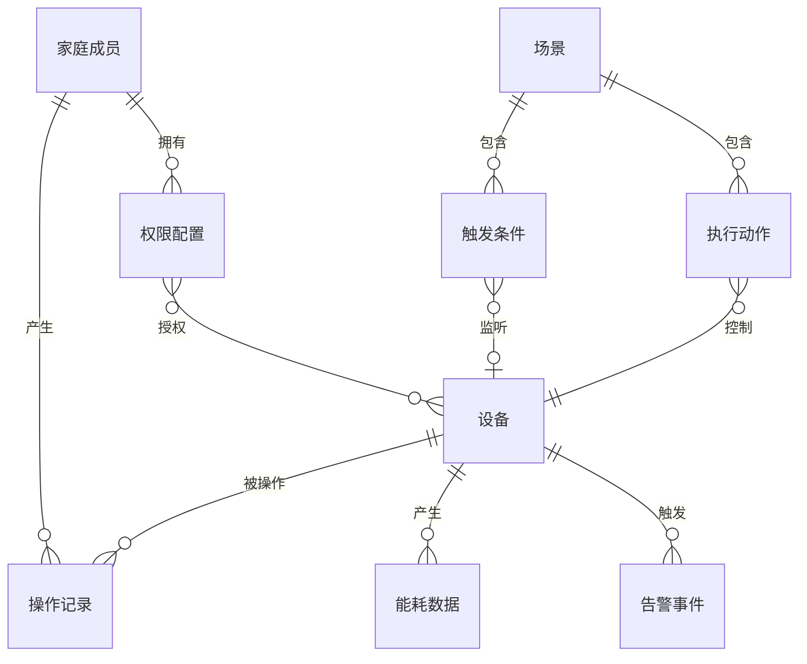

## 1. 架构设计



本项目为纯前端应用，使用 Mock 数据模拟后端API，所有设备状态、场景配置、操作记录、能耗数据均由本地数据驱动。

## 2. 技术说明

- **前端框架**：React@18 + TypeScript
- **构建工具**：Vite
- **样式方案**：TailwindCSS@3 + CSS Modules（复杂组件）
- **状态管理**：Zustand
- **图表库**：Recharts
- **图标库**：Lucide React
- **动画库**：Framer Motion
- **路由**：React Router v6
- **后端**：无（使用 Mock 数据）
- **数据库**：无（使用本地 JSON 模拟）

## 3. 路由定义

| 路由 | 用途 |
|------|------|
| `/` | 首页仪表盘 - 设备状态总览、快捷场景、异常告警、能耗速览 |
| `/devices` | 设备管理页 - 设备列表、设备控制、API接入配置 |
| `/scenes` | 自动化场景页 - 场景列表、场景创建/编辑 |
| `/history` | 操作记录页 - 操作时间线、筛选器 |
| `/energy` | 能耗统计页 - 月度用电量图表、设备能耗排行 |
| `/members` | 家庭成员页 - 成员列表、权限设置、邀请成员 |

## 4. API定义（Mock）

### 4.1 设备相关

```typescript
interface Device {
  id: string
  name: string
  brand: string
  type: 'light' | 'thermostat' | 'lock' | 'sensor' | 'camera' | 'switch' | 'curtain'
  room: string
  status: 'online' | 'offline'
  state: Record<string, any>
  icon: string
  lastUpdated: string
}

interface DeviceState {
  light: { on: boolean; brightness: number; colorTemp: number }
  thermostat: { temperature: number; targetTemp: number; mode: string; on: boolean }
  lock: { locked: boolean; batteryLevel: number }
  sensor: { value: number; unit: string; alertThreshold: number }
  camera: { recording: boolean; streamUrl: string }
  switch: { on: boolean }
  curtain: { position: number }
}
```

### 4.2 场景相关

```typescript
interface Scene {
  id: string
  name: string
  icon: string
  enabled: boolean
  triggers: Trigger[]
  actions: Action[]
  lastExecuted?: string
}

interface Trigger {
  type: 'time' | 'geofence' | 'device_state' | 'manual'
  config: {
    time?: string
    geofence?: { lat: number; lng: number; radius: number }
    deviceId?: string
    stateCondition?: Record<string, any>
  }
}

interface Action {
  deviceId: string
  command: Record<string, any>
  delay?: number
}
```

### 4.3 操作记录

```typescript
interface OperationRecord {
  id: string
  memberId: string
  memberName: string
  deviceId: string
  deviceName: string
  action: string
  timestamp: string
  result: 'success' | 'failed'
}
```

### 4.4 告警事件

```typescript
interface AlertEvent {
  id: string
  type: 'security' | 'safety' | 'device'
  severity: 'critical' | 'warning' | 'info'
  deviceId: string
  deviceName: string
  message: string
  timestamp: string
  resolved: boolean
}
```

### 4.5 能耗数据

```typescript
interface EnergyData {
  deviceId: string
  deviceName: string
  daily: { date: string; kWh: number }[]
  monthly: { month: string; kWh: number }[]
  totalKWh: number
}
```

### 4.6 家庭成员

```typescript
interface FamilyMember {
  id: string
  name: string
  avatar: string
  role: 'admin' | 'member'
  online: boolean
  permissions: {
    deviceIds: string[]
    canCreateScene: boolean
    canManageMembers: boolean
  }
}
```

## 5. 服务端架构

不适用，本项目为纯前端应用。

## 6. 数据模型

### 6.1 数据模型关系



### 6.2 Mock 数据结构

所有 Mock 数据存放在 `src/mocks/` 目录下，按模块拆分：
- `devices.ts` — 设备列表与状态
- `scenes.ts` — 场景配置
- `history.ts` — 操作记录
- `alerts.ts` — 告警事件
- `energy.ts` — 能耗数据
- `members.ts` — 家庭成员与权限
